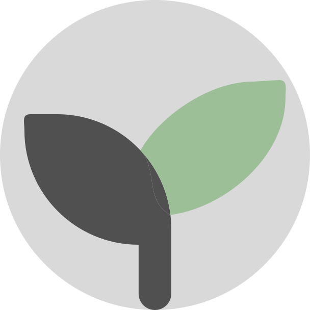

<h1>LifeWild</h1>

Earth's wildlife collection.

<h2>Table of Contents</h2>

- [About](#about)
  - [Technologies](#technologies)
  - [Hosting](#hosting)
  - [API Documentation](#api-documentation)
- [Contributions](#contributions)
  - [Code of Conduct](#code-of-conduct)
- [License](#license)

## About

An online platform that allows users to search for animal entries and learn more about them. With a comprehensive database of various species, users can learn about their scientific classification, species name, conservation status, and more.

### Technologies

LifeWild is a full stack project made using [Next 13](https://nextjs.org/), [Typescript](https://www.typescriptlang.org/), [Tailwind CSS](https://tailwindcss.com/), [Prisma](https://www.prisma.io/), and [MongoDB](https://www.mongodb.com/).

### Hosting

This project is hosted on [vercel](https://vercel.com). You can visit it at [https://lifewild.vercel.app](https://lifewild.vercel.app).

### API Documentation

For a more in-depth explanation of LifeWild's API workings, refer to the following [documentation](API_DOCUMENTATION.md).

## Contributions

Any type of contributions are welcome! Please read the [contribution guidelines](CONTRIBUTING.md) first.

### Code of Conduct

Read more about the code of conduct [here](CODE_OF_CONDUCT.md).

## License

Read more about the license [here](LICENSE.md).